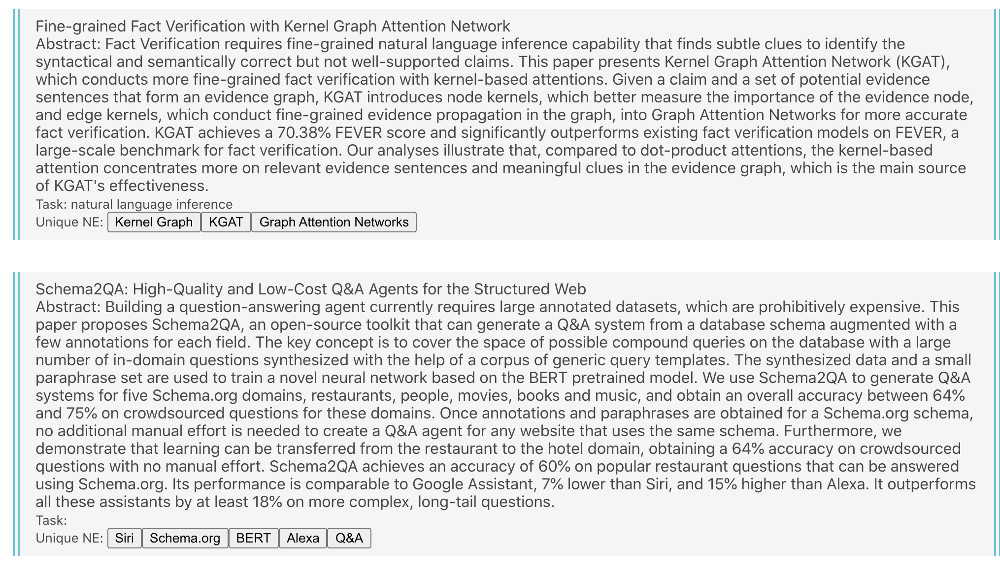
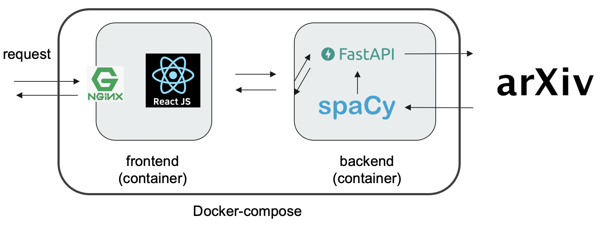

# Arxiv-checker


SPA using Nginx, React, FastAPI(Python).
This app can be built using docker-compose.

We use docker-compose.yml for local development and docker-compose.prod.yml for commercial deployment.

# Architecture


## Preparation
```
$ git clone --recursive https://github.com/izuna385/arxiv-checker
```

### Development
```
$ cd frontend
$ yarn install
$ cd ..
$ docker-compose up --build
# (at Browser: localhost:3000)
# (When you finish coding)
$ docker-compose down
```

### Production
```
$ docker-compose -f docker-compose.prod.yml up -d --build
# (at Browser: localhost)
$ docker-compose down
```
